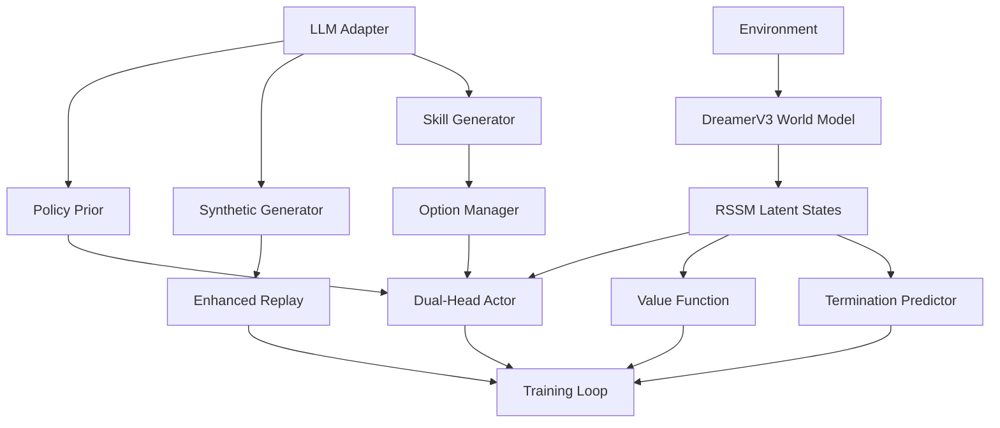

# 🏗️ LoRe Architecture Deep Dive

## 概要

LoRe（LLM-enhanced Reinforcement Learning）は、DreamerV3を基盤とした世界モデルベースRLに、LLMの知識と計画力を3つの経路で統合するフレームワークです。

## 🧠 核心設計原則

### 1. LLM as Advisor（助言者）
- **勾配フロー停止**: `stopgrad()`でLLMへの勾配を遮断
- **可逆的統合**: βゲートとKL制約で影響を制御可能
- **コスト効率**: キャッシュとトリガーベース呼び出しで計算コスト最小化

### 2. 分布シフト対策
- **KL制約**: `KL(π_mix || π_wm) ≤ δ_target`
- **BC正則化**: 合成データでの行動クローニング損失
- **重要度制限**: 合成データの重み減衰と上限設定

### 3. 階層的スケーラビリティ
- **Option層**: プリミティブ行動を高レベルスキルに組織化
- **自動管理**: 性能ベースのスキル生成・評価・削除
- **Call-and-Return**: 完了まで実行する階層制御

---

## 🔧 システム構成

### コアコンポーネント



### データフロー

1. **観測→潜在状態**: World Modelで観測をRSSM潜在状態に符号化
2. **LLM推論**: トリガー条件でLLMから助言を取得
3. **統合意思決定**: 
   - Policy Prior: `logits_mix = logits_wm + β * stopgrad(logits_llm)`
   - Option選択: Dual-Head Actorでプリミティブ/オプション選択
   - 合成経験: LLMプランを世界モデルで実行してリプレイ追加

---

## 📊 3つの統合経路詳細

### A) Replay拡張（合成経験）

**目的**: 探索の多様化を低コストで実現

```python
# 合成遷移の重み付き学習
w = (1 - is_synth) + is_synth * w_synth
loss_weighted = w * loss_base

# BC正則化（分布シフト抑制）
L_BC = λ_bc * E_synth[-log π_ψ(a_t | s_t)]
```

**実装ポイント**:
- `EnhancedReplayBuffer`: 合成/実データを比率制御でサンプリング
- `SyntheticExperienceGenerator`: LLMプランを世界モデルでロールアウト
- 重み減衰: `w_synth *= decay^t` で古い合成データの影響削減

### B) Policy Prior（不確実性ベースバイアス）

**目的**: 方策の方向性をLLMで改善

```python
# 不確実性計算
uncertainty = 0.5 * H(π) + 0.3 * Var(V) + 0.2 * model_disagreement

# βゲート（不確実性に応じて適応）
β = β_max * sigmoid(2.0 * (uncertainty - threshold))

# ロジット混合
logits_mix = logits_wm + β * stopgrad(logits_llm)
```

**安全機構**:
- ターゲットKL制約: Lagrange乗数でKL発散を制御
- 価値ガード: LLM助言が価値を大幅悪化させる場合は却下
- 可逆性: β=0で元の方策に戻せる

### C) Option層（階層的スキル）

**目的**: 長期依存タスクを階層分解

```python
# 拡張行動空間
A' = A_primitive ∪ {option_m}

# Dual-Head Actor
primitive_logits = primitive_head(h)
option_logits = option_head(h)
combined_logits = concat([primitive_logits, option_logits])

# Call-and-Return実行
if selected_option:
    while not terminated:
        action = option.get_next_primitive_action()
        execute(action)
```

**スキル管理**:
- 成功率ベース評価: `success_rate < min_threshold` で削除
- LLM生成: コンテキスト適応的なスキル提案
- 終了予測: ニューラル網で最適な終了タイミング学習

---

## 🧮 数学的定式化

### 世界モデル学習
```
L_WM = E[(log p(o_t|s_t) + log p(r_t|s_t) + log p(γ_t|s_t))] - β_KL * KL[q(s_t|o≤t) || p(s_t|s_{t-1}, a_{t-1})]
```

### Policy Prior統合
```
π_mix(a|s) = softmax((logits_wm(s) + β(s) * stopgrad(logits_llm(x))) / τ)
subject to: KL(π_mix || π_wm) ≤ δ_target
```

### 合成データ重み付け
```
L_total = E_real[L(τ_real)] + E_synth[w_synth * L(τ_synth) + λ_bc * L_BC(τ_synth)]
```

### Option価値学習
```
Q^π(s,ω) = E[∑_{t=0}^{T_ω} γ^t r_t | s_0=s, ω, π]
T_ω ~ Termination(s_t, ω, t_elapsed)
```

---

## ⚡ パフォーマンス最適化

### メモリ効率化
- **Lazy Encoding**: 観測は必要時のみエンコード
- **Buffer Backend**: Windows向けTensor/Memmap切り替え
- **Gradient Checkpointing**: 長系列での省メモリ学習

### 計算効率化
- **LLMキャッシュ**: 状態ハッシュベースでLLM呼び出し削減
- **バッチ処理**: LLM推論とスキル生成の並列化
- **Selective Updates**: 不確実性が低い状態ではLLMスキップ

### トリガー最適化
```python
def should_call_llm(state, td_error, novelty, plateau_frames):
    # 高TD誤差: 学習機会
    if td_error > threshold_high: return True
    
    # 高ノベルティ: 未知状態 
    if novelty > threshold_novel: return True
    
    # プラトー検出: 停滞時
    if plateau_frames > threshold_plateau: return True
    
    return False
```

---

## 🔍 監視・デバッグ

### 重要メトリクス

**学習安定性**:
- `uncertainty_gate/avg_kl`: KL制約の状況
- `loss/kl_penalty`: ペナルティ項の大きさ
- `uncertainty/mean`: 平均不確実性レベル

**LLM統合効果**:
- `llm_adapter/cache_hit_rate`: 効率性
- `beta/mean`: 平均的なLLM影響度
- `synthetic/ratio`: 合成データ混合比

**Option性能**:
- `options/avg_success_rate`: スキルの品質
- `skill_gen/success_rate`: 生成成功率
- `options/total_options`: 動的なスキル数

### デバッグフロー
1. **ベースライン確立**: DreamerV3単体で安定学習確認
2. **段階的有効化**: B→A→Cの順で追加し、各段階で性能確認
3. **ハイパラ調整**: β_max, δ_target, synthetic_ratio_max を環境に応じて調整
4. **失敗モード分析**: KL発散暴走、合成データ過依存、スキル品質劣化を監視

---

## 🔮 拡張性設計

### 新環境サポート
```python
# envs/new_env.py
class NewEnvironmentWrapper(TorchRLWrapper):
    def __init__(self, env_name):
        # 環境固有の前処理
        # 行動空間・観測空間の正規化
        
# options/new_skill_library.py  
class NewEnvironmentSkillLibrary(SkillLibrary):
    def get_contextual_skills(self, context):
        # 環境固有のスキルテンプレート
```

### 新LLMバックエンド
```python
# utils/llm_adapters/new_llm.py
class NewLLMAdapter(BaseLLMAdapter):
    def infer_batch(self, obs_batch, contexts, num_actions):
        # 新しいLLM APIの呼び出し
        # 統一的なCodeOut形式で返却
```

### カスタムOption
```python
# options/custom_options.py
class CustomOption(OptionSpec):
    def __init__(self, domain_knowledge):
        # ドメイン特化のオプション実装
        # 終了条件の詳細定義
```

---

## 📈 理論的保証

### 収束性
- **世界モデル**: 十分なデータで環境の真の動力学に収束（DreamerV3の保証を継承）
- **Policy Prior**: KL制約により元方策の近傍に制限、局所収束性維持
- **合成データ**: BC正則化により分布シフトを有界に抑制

### 安全性
- **勾配分離**: LLMへの勾配フローを遮断し、LLM重みの意図しない変更を防止
- **影響範囲制限**: β∈[0,β_max], KL≤δ_target で影響を数学的に制限
- **フォールバック**: LLM失敗時は自動的にベース方策に戻る

### 探索効率性
- **Replay拡張**: 実データ + 合成データで探索範囲拡大、理論的には探索レート改善
- **不確実性ガイド**: 高不確実性状態でのLLM活用により、探索を効率的に方向付け
- **階層分解**: Option により長期タスクの探索を階層的に効率化

---

この設計により、LoReは理論的基盤と実用性を両立し、様々なRL問題に適用可能な汎用フレームワークを実現しています。